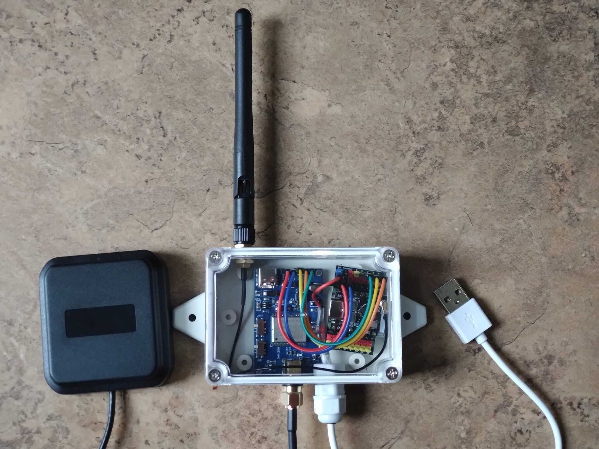
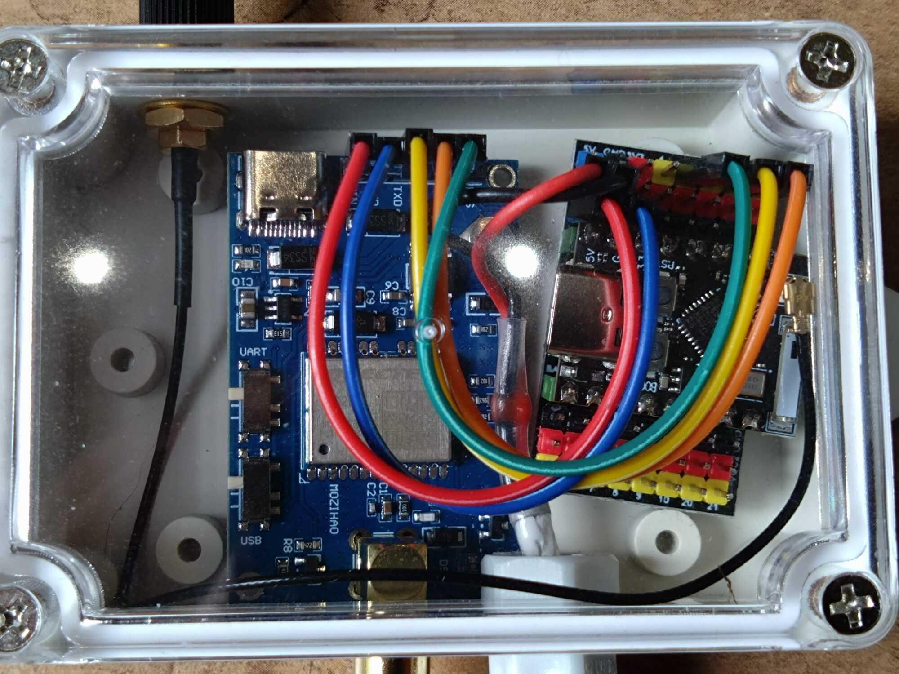

# EPS32 GPS

Micropython code for an ESP32 device to act as an intermediate gateway for a serial GPS module and provide support for RTK/NTRIP services.

Tested with ESP32 S3 (ESP32-S3-WROOM-1-N16R8) C3 Supermini devices and Quectel LC29H(BS/DA/EA) GPS modules.




## Features

(Features in _italics_ are planned).

* (USB) Serial GPS (pass-through).
* Bluetooth LE Serial GPS.
* Rewriting of NMEA sentences on-the-fly (e.g. PQTMEPE -> GPGST accuracy sentences).
* GPS Device Writing (RTCM corrections, hardware setup commands).
* NTRIP `Client` (for Rover), `Server` (for Base Station) and `Caster` (for Base stations).
* ESPNow support for proxying GPS data between ESP32 devices.
* Remote Shell: send GPS commands, update config, reset device etc.

See the [Examples](EXAMPLES.md) file for various use cases and example configs.

## Device Setup

Clone this repository, then do the following (assuming ESP32 device is connected on /dev/ttyACM0):

```
# Set up virtual env
python3 -mvenv venv
venv/bin/pip install -r requirements.txt

# Flash ESP32 module (Change port to suit your device)
venv/bin/esptool [--port /dev/ttyACM0] erase_flash

# Install Micropython (Download from https://micropython.org/download/)
venv/bin/esptool [--port /dev/ttyACM0] write_flash 0 ESP32_MODEL-DATE-VERSION.bin

# Test access to the device
venv/bin/rshell -p /dev/ttyACM0
```

## Configuration

Documentation of all configuration options is found in `config.defaults.py`. This must be copied to `src/config.py` and modified as required.

```
# Copy default config and modify
cp config.defaults.py src/config.py

# Access the device
env/bin/rshell -p /dev/ttyACM0

# Copy code to device
> cp src/*.py /pyboard

# Reset the device to run the code.
```

## Wiring

For C3 Supermini with a GPS module that requires 3v3 and supports UART:

* ESP32 3.3v -> GPS VIN Pin
* ESP32 Gnd -> GPS Gnd Pin
* ESP32 GPIO Pin 1 (TX) -> GPS RX Pin
* ESP32 GPIO Pin 0 (RX) -> GPS TX Pin

_The default TX/RX Pins 0 and 1 can be altered in the config. Remember to connect TX -> RX and vice-versa between GPS and ESP32!_

## Connecting

Logs will be written to the REPL (`sys.stdout`) by default.

Connect the REPL and press `Ctrl-D` to reboot the device. You can then check the logs for appropriate device/service startup, and any errors.

You can easily test GPS NMEA output by setting `ENABLE_BLUETOOTH = True` and the connecting to the device via Bluetooth - for example on Android or IOS using the [SW Maps](https://aviyaantech.com/swmaps/) app.

You can also test NTRIP `Server` & `Caster` again using SW Maps, PyGPSClient or similar GPS tool that acts as an NTRIP client.

## GPS Module Configuration

Connection to a GPS serial module to read data is enabled by setting `GPS_ENABLE = True`. Data read from the device will then be output using one of Serial, Bluetooth or NTRIP Server (forwarding data to Caster via Wifi or ESP-Now).

If your GPS device needs custom commands sent to it, these can be set by adding entries to the list in the `GPS_SETUP_COMMANDS` configuration option. These are applied prior to starting any NTRIP services or reading/writing data to/from the GPS device.

Any data sent by the GPS shortly after sending each command will be logged. If your GPS device responds with an easy-to-identify prefix, you can filter out other data. For example, devices which return responses as proprietary NMEA sentences can be filtered by setting: `GPS_SETUP_RESPONSE_PREFIX = "$P"`.

## GPS Reset

Many GPS devices have a reset pin, which can be pulled high or low to reset the device. For example, the LC29H devices require resetting after saving configuration with the `PQTMSAVEPAR` command.

GPS reset can be configured by setting the following options:

```
ENABLE_GPS_RESET = True
GPS_RESET_PIN = 10                 # The ESP32 GPIO pin connected to the GPS reset pin
GPS_RESET_HIGH = True              # If `True`, the pin will be pulled high to reset. If false, it will be pulled low.
GPS_SETUP_COMMANDS_RESET = False   # Reset GPS after writing setup commands.
```

Reset will occur when the device is reset using the remote shell `RESET` command.

**NOTE** You may need to pull the GPIO pin using a pull-down or pull-up resistor configuration, to prevent a floating pin voltage triggering constant resets.


## NTRIP Support

**NOTE** NTRIP services require Wifi to be enabled to send/receive data from external sources.

This code provide support for `Client`, `Server` and `Caster` NTRIP modes. These can be enabled in parallel by specifying mulitple modes separated by commas for the config option `NTRIP_MODE`.

The most common combination to use is: `NTRIP_MODE = "caster,server"`

This sets up the device to read RTCM data from an RTK-enabled Base Station (`Server`) and offer it up to clients (`Caster`).

### Client

`Client` mode is used to fetch NTRIP data from a `Caster` and write it to the GPS device (this requires an RTK-enabled GPS device).

To use, ensure you set the following configuration options. For example, to connect to Centipede NTRIP Mountpoint called `ABCD`:

```
NTRIP_MODE = "client"
NTRIP_CASTER = "crtk.net"
NTRIP_PORT = 2101
NTRIP_CREDENTIALS = "c:c"
NTRIP_MOUNT = "ABCD"
```

### Server

`Server` mode is used to push NTRIP data being read from an RTK-enabled Base Station to a Caster.

To use, ensure you set the following configuration options. For example, to send data for mount-point `WXYZ` to a private caster:

```
NTRIP_MODE = "server"
NTRIP_CASTER = "mycaster.example.net"
NTRIP_PORT = 2101
NTRIP_CREDENTIALS = "username:password"
NTRIP_MOUNT = "WXYZ"
```

**NOTE** If you are using a public Caster you may need to pre-register your Base station to be allowed to send data to it.

### Caster

`Caster` mode is used to receive NTRIP data from one or more `Servers` and pass that data on to one or more `Clients`.

To use, ensure you set the following configuration options. The Sourcetable must contain at least the Mountpoint field that you expect the server to send data from.

```
# Common config
NTRIP_MODE = "caster"
# Set to the Caster address (for Server or Client mode)
NTRIP_CASTER = "192.168.1.227"
NTRIP_PORT = 2101
# Authentication details for Servers and Clients
NTRIP_CREDENTIALS = "username:password"
# Mount point to accept Serve data for, and send Client data to
NTRIP_MOUNT = "ESP32"

#Caster Config
NTRIP_CASTER_BIND_ADDRESS = "0.0.0.0"
NTRIP_CASTER_BIND_PORT = 2101
NTRIP_SOURCETABLE = """
STR;ESP32;ESP32_GPS;RTCM3.3;;2;GLO+GAL+QZS+BDS+GPS;NONE;GBR;56.62;-3.94;0;0;NTRIP ESP32_GPS;none;B;N;15200;ESP32_GPS
"""

```

**NOTE** The `Caster` module can support multiple `Server` connections - each server must send data from a different mountpoint, and each mountpoint myust be specified in the `NTRIP_SOURCETABLE`. It can also support multiple clients connecting to the same or different mountpoints. However be aware of the physical limitations of ESP32 devices in terms of maximum server/client connections!

## Wifi & Bluetooth

Wifi is needed to run NTRIP services that connect to external sources. You can either set the `WIFI` config options to cause a connection to be set up, or manually set up networking in `boot.py`.

**NOTE** ESP32 wifi state is preserved across soft-reboots. If you set `WIFI_SSID` to a different value than that of the current connection, the connection will be dropped and a new one established. However if you remove Wifi config options, the device may still connect to the last-known ssid. Yuo either need to manually reset the Wifi settings, or set `WIFI_SSID` to a non-existent ssid, which will result in no Wifi connection.


If bluetooth is enabled, then this will appear as a Bluetooth LE serial GPS device, serving up data read from the real GPS device.

**NOTE** Many ESP32 devices have insufficient RAM to run both Bluetooth and Wifi as well as do any meaningful work. It is therefore not recommended to run Bluetooth as well as Wifi/NTRIP services.


## ESP-Now

ESP-Now can be enabled to act as a proxy and send all GPS data (RTCM and NMEA) from one device to others.

ESP-Now support can be enabled by setting `ESPNOW_MODE` to one of `sender`, `receiver` (or left empty to disable).

ESP-Now requires peers to be explicitly defined for communication between devices. This can be done in one of 2 ways:

1. Add the sender/receiver to each other's `ESPNOW_PEERS` list configuration option.
2. Set `ESPNOW_DISCOVER_PEERS = True`. This will cause each peer to regularly broadcast it's own MAC address, and add any it sees to its peer list.

**NOTE** While option 2 is more convenient, this approach uses slightly more resource (sending/receiving peer broadcasts). It will also cause issues if running multiple ESP-Now networks in the same area, as all peers seen will be added.


### Sender

The sender will consume GPS data from a GPS module (ensure `GPS_ENABLE=True`) and send it to all `ESPNOW_PEERS`.

Wifi credentials can be left blank. (If you are using ESP-Now it is usually because wifi is not available!)

### Receiver

The receiver will consume GPS data from the first peer in `ESPNOW_PEERS`.

This data will then be handled as if it had come from a GPS device, so can be output via serial, bluetooth, NTRIP server etc.

**NOTE** In receiver mode no data will be read from the GPS serial device, to avoid conflicting data coming from 2 sources.

## Remote Shell

The Remote Shell can be enabled by setting `ENABLE_SHELL = True`. If `SHELL_PASSWORD` value is set, then the shell will prompt for the password, and exit if not correct.

You can connect to the shell with `nc`, `telnet` or similar network tool. By default the shell listens on port 51716.

### Shell commands

Shell commands are Upper-case words, optionally followed by options:

#### RESET

Does a hard-reset of the ESP32 and GPS devices.

```
>>> ESP32-GPS Remote Shell <<<
> RESET
```

#### RESETGPS

Just reset the GPS device (if `ENABLE_GPS_RESET` is enabled).

```
>>> ESP32-GPS Remote Shell <<<
> RESETGPS
GPS device reset.
```


#### GPS

Sends a command to the GPS device. The NMEA $ and CRC will ber added automatically.

**NOTE** The config option `GPS_SETUP_RESPONSE_PREFIX` also applies here, to filter GPS responses.

For example, on a Quectel LC29H GPS, the firmware version can be queried by doing:

```
>>> ESP32-GPS Remote Shell <<<
> GPS PQTMVERNO
$PQTMVERNO,LC29HEANR11A03S_RSA,2023/10/31,16:52:14*2B
```

#### CFG

Reports current configuration, or sets a configuration value. 

If run without any arguments, `CFG` will output a list of all current configuration options.

f run with an argument, the current in-memory config will be written to config.py, with the new value added/updated. Multiple options must be set one at a time with multiple `CFG` commands.

**NOTE** Once the config has been updated, you may need to reset the device for it to take effect.

The syntax is `CFG KEY=val`. val can be any of int, float, string (quoted), list.

**NOTE** Setting invalid config values may result in a broken config, which will need to be fixed by manually accessing the device!

For example, to disable NTRIP services:
```
>>> ESP32-GPS Remote Shell <<<
> CFG NTRIP_MODE=""
Updated config: NTRIP_MODE=""
```

## Testing & Performance

This code has been successfully tested on a C3 Supermini (with a GPS device sending RTCM and NMEA messages) running `Caster` and `Server` NTRIP services, while also streaming location data to SW Maps via Bluetooth, or via USB serial. However in most real-world use these would be split to two separate devices: one Base station and one Rover.

In practice, there may be memory constraints running Caster, Server and serving to more than 3-4 clients.

Debugging can be enabled by setting `DEBUG=True` in `src/debug.py`.

**NOTE** the generation of some debug messages may impact performance or efficiency - do not leave debugging enabled in production!

This module writes logs using the proprietary NMEA sentence `$PLOG` - this allows log messages to be interleaved with GPS data on the USB serial output without causing issues with anything consuming the stream. Log messages shoudl therefore be displayed in clients that log proprietary NMEA sentences.

Any issues, features or comments, especially if tested on other ESP32 or equivalent hardware types, appreciated!
